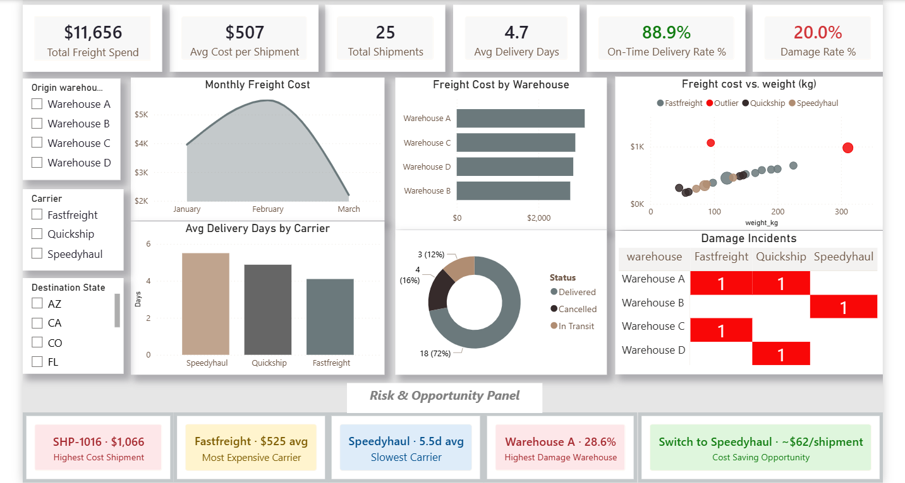

 # 🚚 Freight & Logistics Performance Dashboard
 

A Power BI dashboard I built to help logistics teams and business leaders monitor freight costs, carrier performance, warehouse efficiency, and delivery reliability from a single view.

The goal was to transform raw shipment data into actionable insights that support faster operational and cost-saving decisions.

## Dashboard Overview

This dashboard answers key business questions such as:

* How much are we spending on freight?
* Which carriers are the most cost-effective?
* Which warehouses generate the most operational issues?
* Are deliveries meeting expected timelines?
* Where are the biggest opportunities for cost reduction?

## Key Metrics

* Total Freight Spend
* Total Shipments
* Average Delivery Time
* On-Time Delivery Rate
* Damage Rate
* Average Cost per Shipment

## Dashboard Features

### Executive Summary

A high-level overview of logistics performance with KPI tracking, shipment trends, operational risks, and warehouse performance.

### Carrier Performance Analysis

Compares carriers across delivery speed, freight cost, and service reliability to identify the strongest and weakest performers.

### Freight Cost Analysis

Tracks freight spending trends and highlights cost drivers, outliers, and shipping efficiency.

### Warehouse Performance

Measures shipment volume, damage incidents, and operational efficiency across warehouses.

## Key Insights

* Identified the most expensive carrier and highest-cost shipments.
* Highlighted warehouses with elevated damage rates.
* Measured on-time delivery performance against operational targets.
* Uncovered potential freight cost-saving opportunities through carrier optimization.

## Tools Used

* Power BI
* DAX
* Power Query
* Microsoft Excel

## Skills Demonstrated

* Data Cleaning
* Data Modeling
* DAX Calculations
* KPI Development
* Executive Dashboard Design
* Logistics & Supply Chain Analytics
* Business Intelligence Reporting

## Business Impact

This dashboard enables decision-makers to quickly identify operational risks, monitor logistics performance, and make data-driven decisions that improve efficiency while reducing freight costs.

